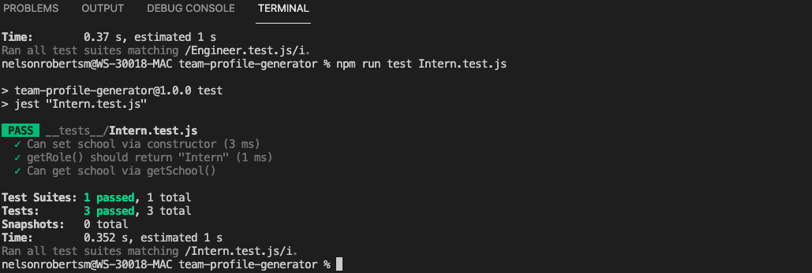

# Team-Profile-Generator

## Project Description

Creating an HTML profile using input from the command line for the development team.Please see screen hsots below for more details.

## Installation instructions 

* Clone git repository.
* In the same directory the project in cloned in..Run npm install
* Answer all prompts
* HTML will be generated
* Run genarated HTML on the browser

## Video Capture of the Running Application Local Environment

https://screencast-o-matic.com/player/crlI6ZV2wOw?width=1280&height=800&ff=1&title=0&a=1

## Screenshots of Running Application On the Browser

* Running Application  of the generated HTML fine on the browser

## Screenshots of Running Application In Command Line!!

* Running Application on command line with Question Prompts

## Screenshots of Tests

*  Passing Employee Test

* Passing Manager Test

* Passing Engineer Test

* Passing Intern Test

* All Tests Passing

